# Planit - AI 기반 소셜 챌린지 트래커

> 작은 성취를 실시간으로 공유하고, AI가 다음 도전을 추천해주는 동기부여 플랫폼

[](https://opensource.org/licenses/MIT)
[](https://spring.io/projects/spring-boot)
[](https://nextjs.org/)
[](https://www.postgresql.org/)
[](https://redis.io/)
[](https://ai.google.dev/)
[]()

**📚 상세 기술 문서**: [TECHNICAL.md](TECHNICAL.md) - 설치 가이드, API 명세, 아키텍처 상세 정보

---

## 🎯 프로젝트 개요

### 문제 정의
기존의 목표 관리 앱들은 개인의 성취를 기록하는 데 그치며, 사용자 간 상호작용과 동기부여 요소가 부족합니다. 또한 다음에 어떤 도전을 해야 할지 고민하는 사용자들에게 개인화된 추천을 제공하지 못하는 한계가 있습니다.

### 솔루션
**Planit**은 AI 기반 개인화 추천과 실시간 소셜 기능을 결합한 챌린지 트래킹 플랫폼입니다:

- **AI 기반 챌린지 추천/생성**: Gemini AI가 사용자의 참여 이력을 분석하여 적합한 챌린지를 추천하고, 자연어 입력만으로 새로운 챌린지를 자동 생성
- **실시간 소셜 피드**: SSE(Server-Sent Events) 기반으로 "OO님이 방금 인증했습니다!" 알림을 실시간으로 브로드캐스트
- **게임화 시스템**: 포인트, 배지, 연속 인증 스트릭, 실시간 랭킹으로 지속적인 동기부여 제공
- **AI 인증 검증**: 업로드된 인증 사진을 Gemini AI가 자동으로 분석하여 챌린지 적합성 판단

---

## ✨ 주요 성과 하이라이트

- ✅ **50+ API 엔드포인트** 구현 (Spring Boot + Kotlin)
- ✅ **18+ 프론트엔드 페이지** 구현 (Next.js 16 + TypeScript)
- ✅ **~70% 완료율** (핵심 기능 및 AI 기능 완료)
- ✅ **3가지 AI 기능** 통합 (Google Gemini AI)
  - AI 챌린지 추천 (참여 이력 기반)
  - AI 챌린지 자동 생성 (자연어 입력)
  - AI 인증 사진 분석 (적합성 자동 판단)
- ✅ **실시간 SSE 기반** 피드/알림/랭킹 시스템
- ✅ **Redis 기반 고성능** 캐싱 및 랭킹 시스템
- ✅ **14개 컨트롤러**, **5개 스케줄러** 구현
- ✅ **게임화 시스템** (포인트, 배지, 스트릭, 리더보드)

---

## 🛠️ 기술 스택

### 백엔드 (85% 비중)
- **Core**: Spring Boot 3.2, Kotlin 1.9.20
- **Database**: PostgreSQL 15+ (주 데이터베이스)
- **Cache**: Redis 7+ (캐싱 + Pub/Sub + Sorted Set)
- **Security**: Spring Security + JWT 인증
- **Real-time**: SSE (Server-Sent Events)
- **AI**: Google GenAI SDK (Gemini AI 2.0)
- **Image**: Thumbnailator (리사이징/압축)
- **Scheduling**: Spring @Scheduled (5개 스케줄러)

### 프론트엔드
- **Framework**: Next.js 16, React 19, TypeScript
- **Styling**: Tailwind CSS 4, Shadcn/ui
- **State Management**:
  - Zustand (클라이언트 상태: auth, notifications, ranking)
  - React Query (서버 상태 동기화)
- **Real-time**: EventSource API (SSE 클라이언트)
- **Charts**: Recharts (통계 시각화)

### 인프라
- **Containerization**: Docker, Docker Compose
- **CI/CD**: GitHub Actions
- **Deployment**: Render
- **Storage**: 로컬 파일 시스템 (날짜별 디렉토리 구조)

---

## 🚀 핵심 기능

### 5.1 AI 기반 개인화

#### AI 챌린지 추천 엔진
- **기존 챌린지 추천**: 사용자의 참여 이력을 Gemini AI가 분석하여 유사한 챌린지 추천
- **자연어 쿼리 지원**: "운동 관련 챌린지 추천해줘" 같은 자연어 입력으로 검색
- **추천 이유 제공**: 각 추천마다 "왜 이 챌린지가 적합한지" 설명 제공

#### AI 챌린지 생성기
- **자동 생성**: 키워드나 자연어 입력만으로 챌린지 제목, 설명, 카테고리, 난이도 자동 생성
- **프롬프트 엔지니어링**: 구조화된 JSON 출력으로 정확한 결과 보장
- **폼 자동 채우기**: 생성된 결과를 챌린지 생성 폼에 자동으로 반영

#### AI 인증 분석기
- **자동 검증**: 업로드된 사진이 챌린지 주제에 적합한지 Gemini AI가 자동 분석
- **적합성 판단**: `isSuitable` 플래그로 적합/부적합 판정
- **분석 결과 저장**: 분석 결과를 DB에 저장하여 추적 가능
- **재분석 기능**: 필요 시 인증 사진을 다시 분석 가능

### 5.2 실시간 소셜 경험

#### 실시간 피드
- **SSE 기반 알림**: "OO님이 방금 '아침 운동' 챌린지를 인증했습니다!" 실시간 브로드캐스트
- **연결 관리**: SseEmitter 연결 풀 관리, 타임아웃, 하트비트(30초)
- **팔로잉 피드**: 팔로우한 사용자의 인증만 선별적으로 표시

#### 실시간 랭킹
- **Redis Sorted Set**: 포인트 기반 순위를 Redis에서 실시간 관리
- **SSE 스트림**: 순위 변동이 발생하면 즉시 클라이언트에 푸시
- **포디움 UI**: 상위 3명에게 🥇🥈🥉 강조 표시

#### 팔로우 시스템
- **팔로우/언팔로우**: 관심 있는 사용자 팔로우
- **팔로워/팔로잉 목록**: 페이징 지원
- **카운트 캐싱**: Redis를 통한 고속 팔로워 수 조회

### 5.3 게임화 시스템

#### 포인트
- **적립 규칙**:
  - 인증 작성: +10 포인트
  - 댓글 작성: +2 포인트
  - 좋아요: +1 포인트
  - 배지 획득: +5 포인트
- **히스토리**: 모든 포인트 적립/차감 내역 추적
- **통계**: 일별 획득 포인트, 누적 추이 차트 (Recharts)

#### 배지 시스템
- **자동 부여**: 조건 달성 시 자동으로 배지 부여 (비동기 처리)
- **다양한 조건**:
  - 인증 횟수 (첫 인증, 10회, 50회, 100회)
  - 연속 인증 (3일, 7일, 30일 스트릭)
  - 소셜 활동 (팔로워 10명, 댓글 50개)
  - 포인트 (100점, 500점, 1000점)
- **등급 시스템**: 브론즈 → 실버 → 골드 → 플래티넘
- **BadgeChecker 패턴**: Factory 패턴으로 확장 가능한 배지 조건 체크

#### 스트릭 (연속 인증)
- **자동 추적**: 챌린지별 연속 인증 일수 자동 계산
- **캘린더 UI**: GitHub 스타일 활동 잔디 시각화
- **리더보드**: 챌린지별 최장 스트릭 순위
- **리마인더**: 매일 저녁 8시, 오늘 미인증 시 알림 발송

#### 랭킹 (리더보드)
- **실시간 업데이트**: SSE를 통한 순위 변동 즉시 반영
- **기간별 랭킹**: 주간 / 월간 / 전체
- **자동 아카이브**: 주간(일요일 23:55), 월간(월말 23:55) 랭킹 스냅샷 저장
- **내 순위 조회**: 전체 랭킹에서 내 위치 빠르게 확인

### 5.4 챌린지 & 인증

#### 챌린지 관리
- **CRUD**: 생성, 조회, 수정, 삭제 (소프트 삭제)
- **참여/탈퇴**: 챌린지 참여 및 탈퇴 기능
- **검색**: Full-Text Search 기반 키워드 검색
- **필터링**: 카테고리, 난이도, 기간, 상태별 필터링
- **통계**: 참여자 수, 인증 수, 완료율, 조회수

#### 인증 작성
- **사진 업로드**: 로컬 파일 시스템에 날짜별 디렉토리로 저장
- **자동 리사이징**: Thumbnailator로 최대 1600px, 품질 80% 자동 최적화
- **AI 검증**: Gemini AI 기반 적합성 자동 분석
- **댓글 & 좋아요**: 인증에 댓글 달기, 좋아요 토글

---

## 🏗️ 시스템 아키텍처

### 6.1 백엔드 아키텍처

```
┌─────────────────────────────────────────────────┐
│          Controller Layer (14개)               │
│  Auth, User, Challenge, Certification, Follow,  │
│  Feed, Notification, LikeComment, Badge,        │
│  Point, Ranking, RankingSse, Streak, Health     │
└─────────────────────────────────────────────────┘
                      ↓ DTO
┌─────────────────────────────────────────────────┐
│          Service Layer (18개)                   │
│  비즈니스 로직, AI 연동, SSE 관리, 배지 체크     │
└─────────────────────────────────────────────────┘
                      ↓ Entity
┌─────────────────────────────────────────────────┐
│          Repository Layer (14개)                │
│  Spring Data JPA, Custom Queries                │
└─────────────────────────────────────────────────┘
                      ↓
┌──────────────────────────┬──────────────────────┐
│     PostgreSQL 15+       │      Redis 7+        │
│   (주 데이터베이스)        │  (캐싱 + Pub/Sub)    │
└──────────────────────────┴──────────────────────┘
```

**주요 패턴**:
- **BadgeChecker Factory Pattern**: 배지 조건 체크 로직을 인터페이스와 팩토리로 확장 가능하게 설계
- **SSE EventStream 관리자**: SseEmitter 연결 풀 관리 (타임아웃, 하트비트, 자동 정리)
- **Redis Pub/Sub**: 알림 팬아웃 (한 번의 이벤트를 여러 구독자에게 전송)
- **Scheduled Tasks**: 5개 스케줄러 (스트릭, 랭킹, 챌린지 리마인더, 조회수 동기화, 파일 정리)

### 6.2 프론트엔드 아키텍처

```
┌─────────────────────────────────────────────────┐
│              Pages (18+)                        │
│  홈, 대시보드, 챌린지, 인증, 피드, 랭킹, 프로필   │
└─────────────────────────────────────────────────┘
                      ↓
┌─────────────────────────────────────────────────┐
│           Components (40+)                      │
│  재사용 가능한 UI 컴포넌트 (Shadcn/ui 기반)      │
└─────────────────────────────────────────────────┘
                      ↓
┌──────────────────────────┬──────────────────────┐
│   Hooks (14+)            │   Services (11+)     │
│  커스텀 훅                │   API 클라이언트      │
└──────────────────────────┴──────────────────────┘
                      ↓
┌──────────────────────────┬──────────────────────┐
│   Zustand Stores (3개)   │   React Query        │
│  auth, notifications,    │  서버 상태 동기화     │
│  ranking                 │  무한 스크롤          │
└──────────────────────────┴──────────────────────┘
                      ↓
┌─────────────────────────────────────────────────┐
│              Backend API                        │
│  SSE 연결 (EventSource)                         │
└─────────────────────────────────────────────────┘
```

**주요 패턴**:
- **Zustand**: 글로벌 클라이언트 상태 관리 (auth, notifications, ranking)
- **React Query**: 서버 상태 동기화, 캐싱, 무한 스크롤
- **EventSource**: SSE 실시간 연결 (피드, 알림, 랭킹)

### 6.3 데이터 흐름

#### 인증 생성 플로우
```
사용자 → 사진 업로드
       → Gemini AI 분석 (적합성 판단)
       → DB 저장 (Certification)
       → 포인트 적립 (+10)
       → SSE 브로드캐스트 ("OO님이 방금 인증했습니다!")
       → 배지 조건 체크 (비동기)
```

#### 랭킹 업데이트 플로우
```
포인트 변경 이벤트
       → Redis Sorted Set 업데이트 (ZADD)
       → Top 10 변동 감지
       → SSE 스트림 푸시 (실시간 순위 변동)
       → 프론트엔드 실시간 반영
```

#### AI 추천 플로우
```
사용자 챌린지 참여
       → Gemini AI 쿼리 (참여 이력 기반)
       → 유사 챌린지 추천 + 이유 설명
       → 프론트엔드에서 "추천 이유" 표시
```

---

## 💡 기술적 도전과 해결

### 7.1 실시간 성능 최적화

**도전**: SSE 연결이 많아질 때 서버 메모리 부하 및 성능 저하

**해결**:
- **SseEmitter 연결 풀 관리**: 타임아웃(5분), 하트비트(30초), 자동 정리
- **Redis Pub/Sub**: 알림 이벤트를 Redis Pub/Sub으로 팬아웃하여 서버 간 분산 처리 가능하도록 설계
- **조회수 최적화**: 조회수는 Redis 카운터로 실시간 처리 후, 1시간마다 DB 동기화 (스케줄러)

### 7.2 AI API 안정성

**도전**: Gemini AI API 호출 실패 또는 응답 지연 시 사용자 경험 저하

**해결**:
- **모델 폴백**: `gemini-2.0-flash-exp` 실패 시 `gemini-1.5-pro`로 자동 전환
- **재시도 로직**: 최대 3회 재시도
- **타임아웃 설정**: API 호출 타임아웃 10초
- **에러 핸들링**: 실패 시 사용자에게 명확한 에러 메시지 제공

### 7.3 이미지 저장 및 최적화

**도전**: 대용량 이미지 저장 시 디스크 공간 부족 및 로딩 속도 저하

**해결**:
- **자동 리사이징**: Thumbnailator로 업로드 시 자동 리사이징 (최대 1600px, 품질 80%)
- **날짜별 디렉토리**: `uploads/YYYY/MM/DD/` 구조로 파일 분산 저장
- **고아 파일 정리**: 매일 새벽 3시, DB에 연결되지 않은 파일 자동 삭제 (스케줄러)

### 7.4 배지 시스템 확장성

**도전**: 배지 종류가 늘어날수록 조건 체크 로직이 복잡해지고 유지보수가 어려워짐

**해결**:
- **BadgeChecker 인터페이스**: 배지 조건 체크를 인터페이스로 추상화
- **Factory 패턴**: BadgeType에 따라 적절한 Checker 인스턴스 생성
- **확장 가능한 구조**: 새 배지 추가 시 Checker 클래스만 추가하면 됨
  - `CertificationCountChecker`: 누적 인증 횟수
  - `CertificationStreakChecker`: 연속 인증 일수
  - `SocialChecker`: 팔로워 수, 댓글 수
  - `PointChecker`: 누적 포인트

---

## 📊 프로젝트 통계

| 항목 | 수치 |
|------|------|
| **API 엔드포인트** | 50+ |
| **프론트엔드 페이지** | 18+ |
| **백엔드 컨트롤러** | 14개 |
| **서비스 클래스** | 18개 |
| **엔티티** | 14개 |
| **스케줄러** | 5개 |
| **React 컴포넌트** | 40+ |
| **Custom Hooks** | 14+ |
| **API 서비스** | 11+ |
| **Zustand Stores** | 3개 |
| **구현 기능** | 사용자 인증, 챌린지 관리, 인증 시스템, 팔로우, 실시간 피드, 알림, 포인트, 배지, 스트릭, 랭킹(SSE), AI 추천, AI 생성, AI 분석 |
| **완료율** | ~70% |
| **외부 API** | Google GenAI SDK (Gemini AI) |

---

## 🔮 향후 계획

### AI 기능 확장
- **AI 동기부여 코치**: Gemini AI 기반 개인화 격려 메시지 생성
- **AI 추천 알고리즘 고도화**: 협업 필터링, 콘텐츠 기반 필터링 결합

### 인프라 최적화
- **S3/CloudFront 통합**: 이미지 CDN 최적화, 빠른 로딩 속도
- **Redis 캐싱 확대**: 챌린지 목록, 통계 캐싱으로 응답 속도 향상

### 검색 & 성능
- **고급 검색**: 필터링 옵션 확대 (태그, 사용자, 날짜 범위)
- **검색 인덱싱**: PostgreSQL Full-Text Search 최적화 (tsvector, GIN 인덱스)
- **성능 최적화**: DB 쿼리 최적화, N+1 문제 해결, 페이징 개선

### 보안 강화
- **Rate Limiting**: API 요청 제한 (Bucket4j)
- **CSRF 토큰**: CSRF 공격 방지
- **XSS 방지**: HTML 이스케이프

---

## 🖼️ 데모 & 스크린샷

> 💡 **이미지 저장 위치**: `docs/images/` 폴더

### 1. 홈 & 인증

#### 1.1 랜딩 페이지
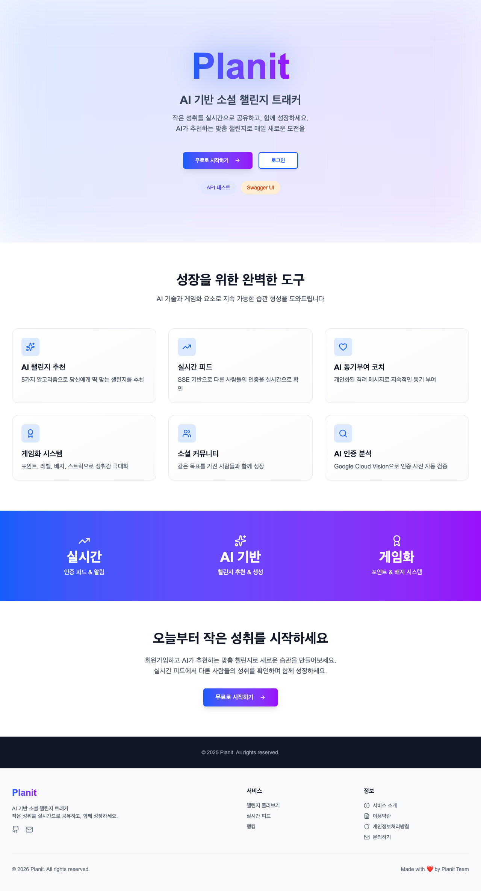

**주요 기능**:
- Hero 섹션 (그라데이션 배경 + 로고 + CTA)
- 6가지 핵심 기능 소개 카드
- 통계 섹션, 개발자 도구 링크

---

#### 1.2 로그인/회원가입
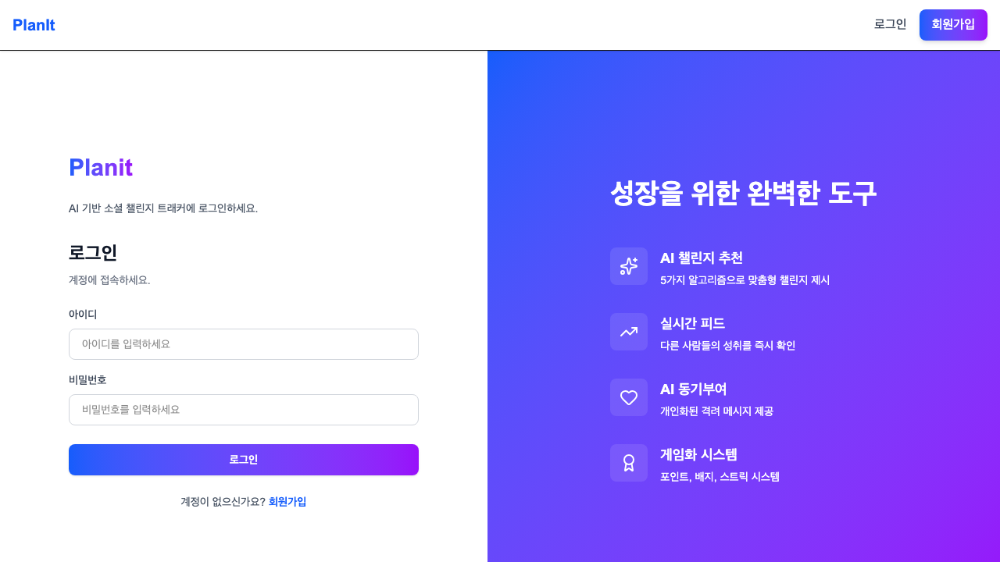
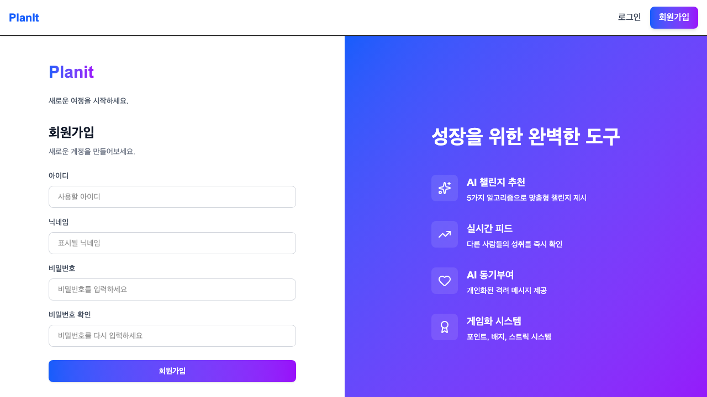

**주요 기능**:
- 이메일/비밀번호 입력 폼
- 이메일 중복 검증 (실시간)
- JWT 토큰 발급

### 2. 대시보드

#### 2.1 메인 대시보드


**주요 기능**:
- 통계 카드 (참여 챌린지, 인증 수, 팔로워/팔로잉)
- 포인트/배지/스트릭 요약
- 참여 중인 챌린지 목록 (진행률)
- 최근 활동 피드 미리보기
- AI 추천 챌린지

### 3. 챌린지

#### 3.1 챌린지 목록
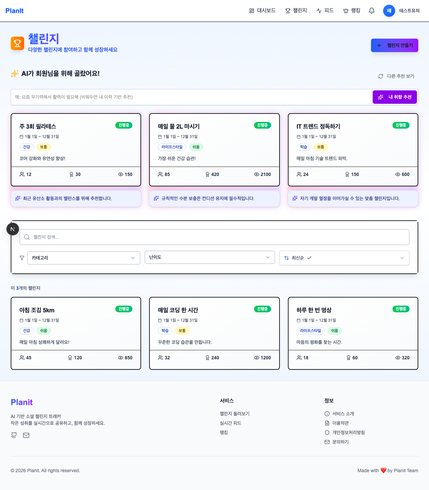

**주요 기능**:
- 필터링 (카테고리, 난이도, 기간, 상태)
- 정렬 (최신순, 이름순, 난이도순, 인기순)
- Full-Text Search 키워드 검색
- AI 추천 챌린지 섹션

---

#### 3.2 챌린지 상세


**주요 기능**:
- 챌린지 정보 (제목, 설명, 카테고리, 난이도, 기간)
- 통계 (참여자 수, 인증 수, 완료율, 조회수)
- 참여/탈퇴 버튼
- 참여자 목록, 인증 피드

---

#### 3.3 AI 챌린지 생성기 ⭐
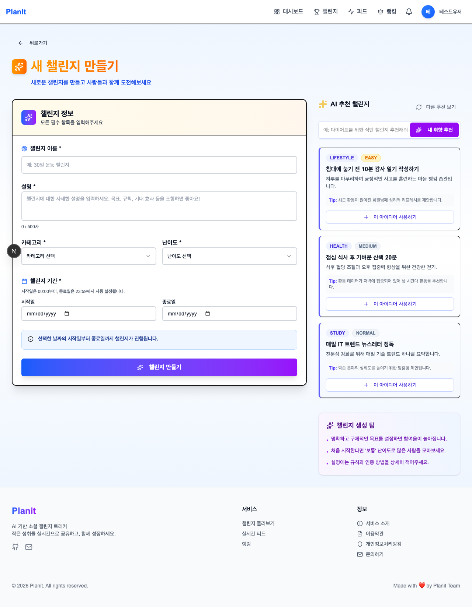

**주요 기능**:
- 자연어 입력으로 챌린지 자동 생성
- Gemini AI 프롬프트 엔지니어링
- 생성 결과 폼에 자동 채우기

### 4. 인증

#### 4.1 인증 작성
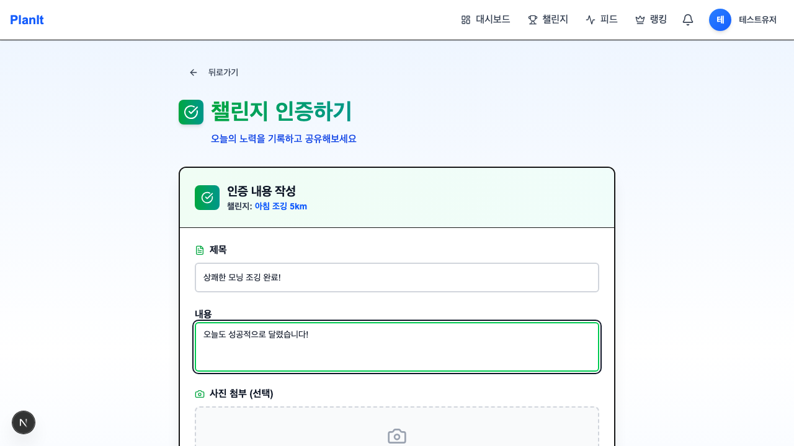

**주요 기능**:
- 참여 중인 챌린지 선택 드롭다운
- 제목/내용 입력 폼
- 사진 업로드 및 미리보기
- **AI 적합성 분석** (Gemini AI)

---

#### 4.2 인증 상세


**주요 기능**:
- 인증 정보 (제목, 내용, 작성자, 작성일)
- 업로드된 사진 표시
- AI 분석 결과 (적합성 판단)
- 좋아요/댓글 기능
- AI 재분석 버튼

---

#### 4.3 내 인증 목록
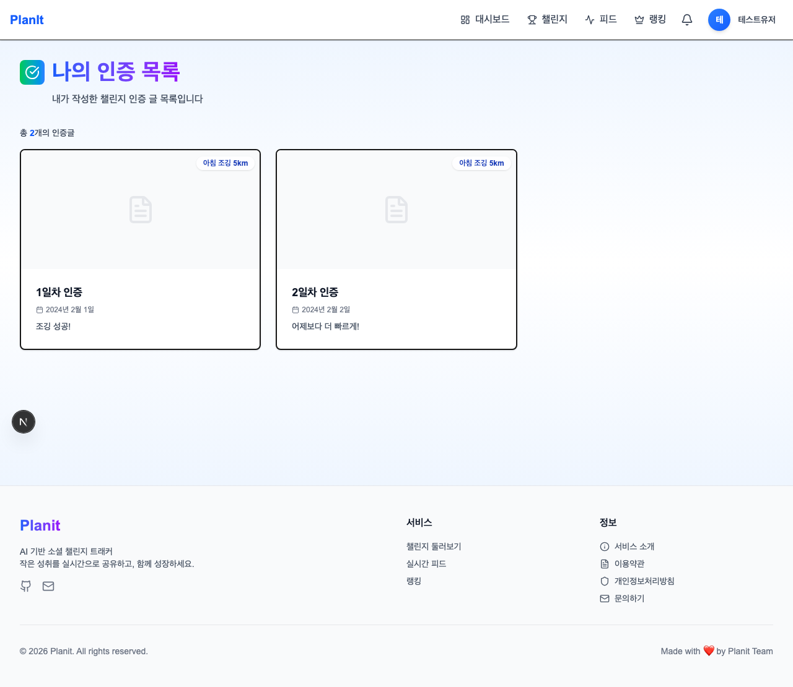

**주요 기능**:
- 인증 카드 (제목, 챌린지명, 좋아요/댓글 수)
- React Query 무한 스크롤

### 5. 실시간 피드 ⭐

#### 5.1 전체 피드 (SSE)
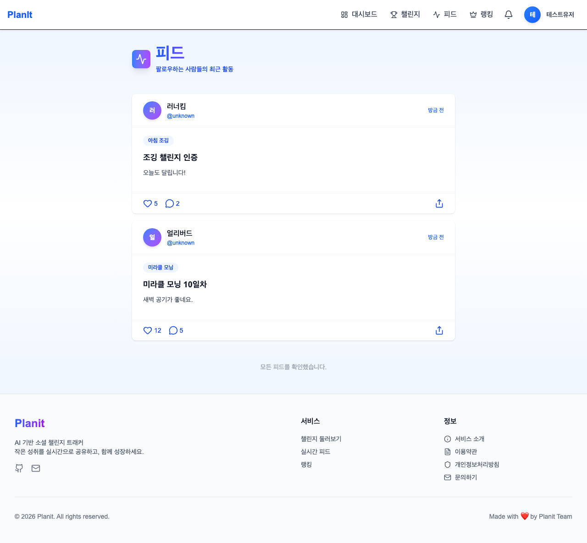

**주요 기능**:
- **SSE 실시간 알림**: "OO님이 방금 인증했습니다!"
- 인증 카드 (프로필, 챌린지명, 사진 썸네일)
- React Query 무한 스크롤
- 정렬 (최신순, 좋아요순, 댓글순, 인기순)

---

#### 5.2 팔로잉 피드


**주요 기능**:
- 팔로우한 사용자의 인증만 선별 표시
- SSE 실시간 업데이트

### 6. 랭킹 시스템 ⭐

#### 6.1 리더보드 (SSE + Redis)
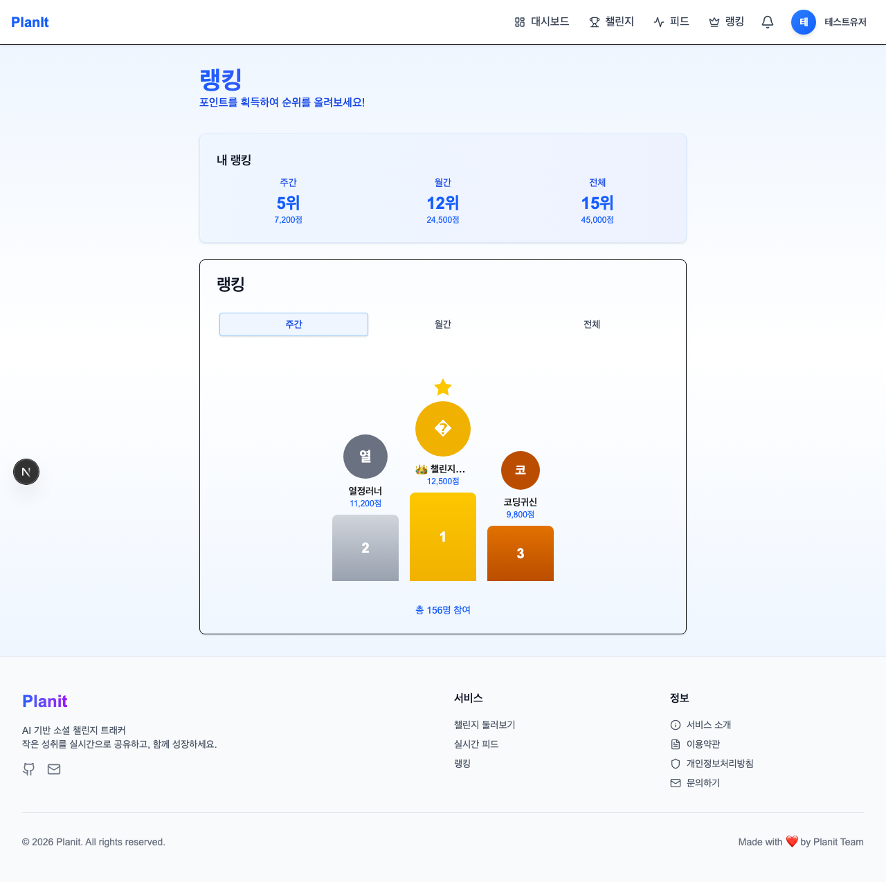

**주요 기능**:
- **포디움 UI**: 상위 3명 강조 (🥇🥈🥉)
- 순위 목록 (순위, 사용자명, 포인트, 변동)
- 기간 선택 (주간 / 월간 / 전체)
- **SSE 실시간 업데이트**: 순위 변동 즉시 반영
- 내 순위 하이라이트

### 7. 프로필

#### 7.1 내 프로필
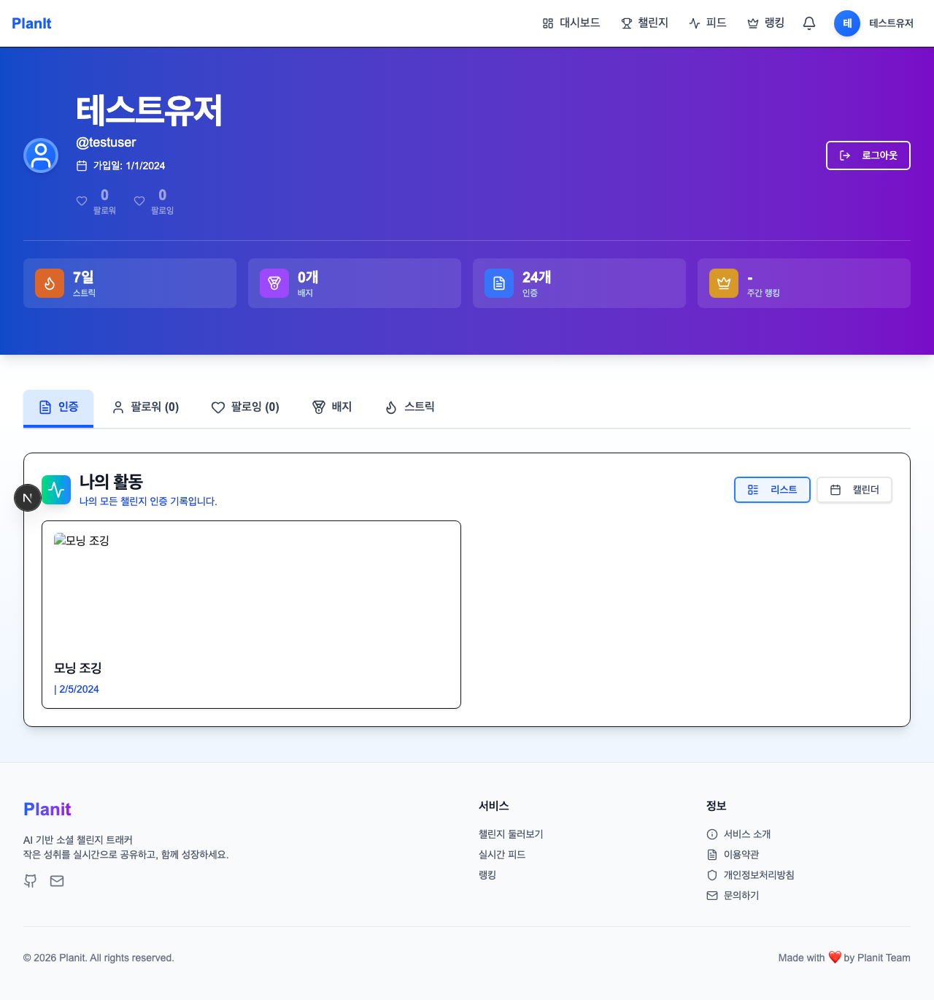

**주요 기능**:
- 프로필 헤더 (닉네임, 이메일, 가입일)
- 통계 요약 (인증 수, 포인트, 팔로워/팔로잉)
- 탭 네비게이션 (인증, 팔로워, 팔로잉, 배지, 스트릭)

---

#### 7.2 다른 사용자 프로필


**주요 기능**:
- 팔로우/언팔로우 버튼
- 사용자 통계 (인증 수, 배지, 스트릭)
- 공개 인증 목록

### 8. 게임화 요소

#### 8.1 포인트 통계
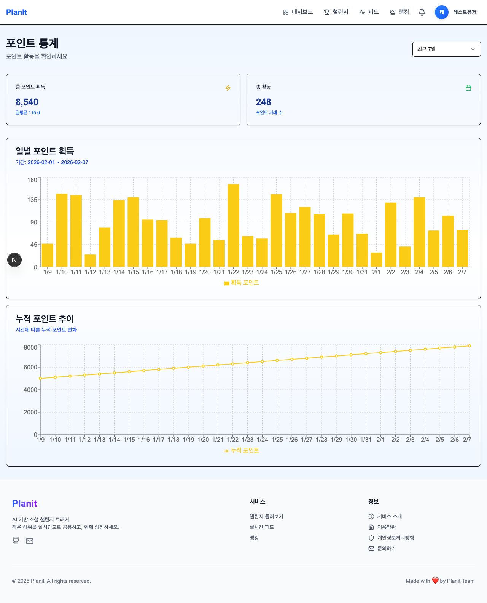

**주요 기능**:
- 포인트 요약 (총, 오늘, 이번 주)
- **Recharts 차트**: 일별 막대, 누적 선 그래프
- 포인트 히스토리 (적립/차감 내역)

---

#### 8.2 배지 시스템


**주요 기능**:
- 전체 배지 목록 (획득/미획득)
- 배지 카드 (이름, 설명, 등급, 조건)
- 진행률 표시 (예: 50/100 인증)

---

#### 8.3 스트릭 캘린더


**주요 기능**:
- **GitHub 스타일 활동 잔디**
- 현재/최고 스트릭 표시
- 월별 네비게이션

### 9. 알림

#### 9.1 알림 드롭다운 (SSE)
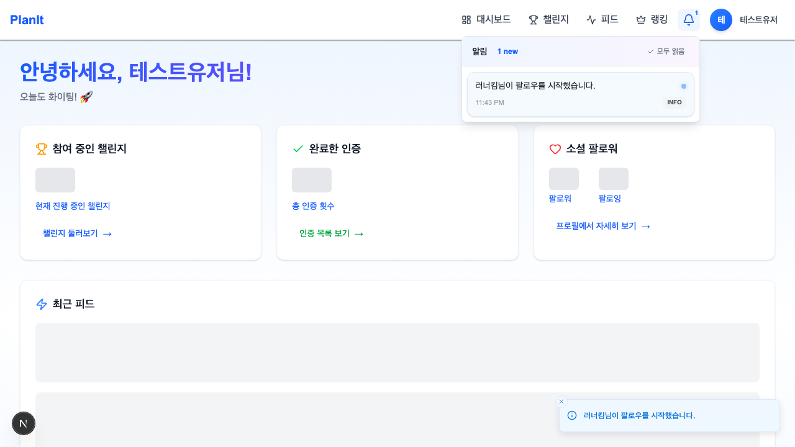

**주요 기능**:
- SSE 실시간 알림 수신
- 미읽음 카운트 (빨간 배지)
- 최근 알림 10개 미리보기
- 자동 읽음 처리

---

### 10. 사용자 찾기

#### 10.1 사용자 목록


**주요 기능**:
- 닉네임/이메일 검색
- 사용자 카드 (프로필, 팔로워 수)
- 팔로우 버튼, 페이지 네비게이션

---

### 11. 설정

#### 11.1 계정 설정
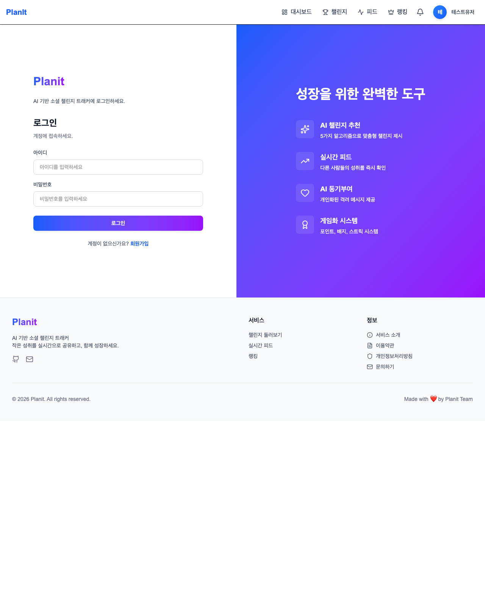

**주요 기능**:
- 프로필 수정 (닉네임)
- 비밀번호 변경 (기존 비밀번호 검증)
- 회원 탈퇴

---

## 📞 연락처 & 링크

- **GitHub Repository**: [Planit Repository](https://github.com/SeoHyeokGyu/planit)
- **API 문서 (Swagger)**: `http://localhost:8080/swagger-ui.html`

---

## 📄 라이선스

MIT License

---

**프로젝트 기간**: 2024.XX ~ 2025.XX
**개발자**: [이름]
**이메일**: [이메일]

---

> "작은 성취도 함께 나누면 큰 동기부여가 됩니다" - Planit
